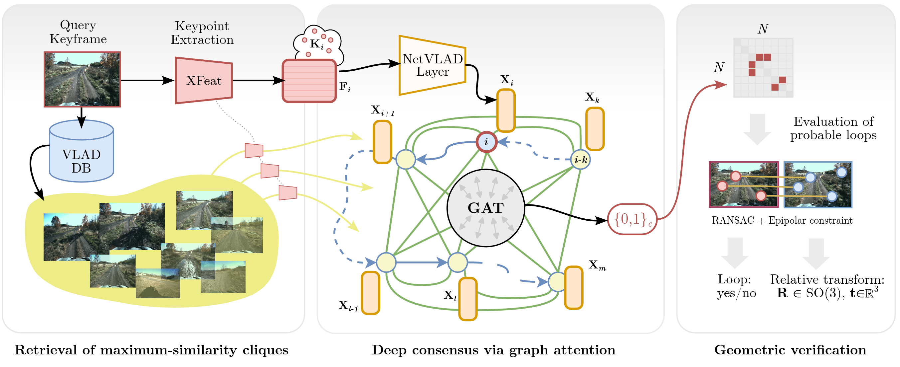

# LoopGNN
[**arXiv**](https://arxiv.org/abs/2505.21754) | [**Website**](https://loopgnn.cs.uni-freiburg.de/) | [**Video**](https://www.youtube.com/watch?v=wz-2vB92M50)

This repository is the official implementation of the paper:

> **Visual Loop Closure Detection Through Deep Graph Consensus**<br>
> [Martin Büchner](https://rl.uni-freiburg.de/people/buechner), [Liza Dahiya](https://global.honda/en/RandD/), [Simon Dorer](https://rl.uni-freiburg.de/people/), [Vipul Ramtekkar](https://global.honda/en/RandD/), [Kenji Nishimiya](https://global.honda/en/RandD/), [Daniele Cattaneo](https://rl.uni-freiburg.de/people/cattaneo), [Abhinav Valada](https://rl.uni-freiburg.de/people/valada). <br>
> IEEE/RSJ International Conference on Intelligent Robots and Systems (IROS), 2025

<p align="center">
  
</p>

If you find our work useful, please consider citing our paper:
```
@article{buechner2025visual,
  author={Büchner, Martin and Dahiya, Liza and Dorer, Simon and Ramtekkar, Vipul and Nishiimiya, Kenji and Cattaneo, Daniele and Valada, Abhinav},
  title={Visual Loop Closure Detection Through Deep Graph Consensus},
  journal={IEEE/RSJ International Conference on Intelligent Robots and Systems (IROS)},
  year={2025},
}
```

## 🏗️ Installation
We recommend following this routine to set up the repo:

0️⃣ Clone the repository:
  ```
    git clone https://github.com/robot-learning-freiburg/loopgnn/tree/main --recurse-submodules
    cd imm && git submodule update --init --recursive && pip install -e . 
  ```
  This recurses the [image-matching-models repo](https://github.com/alexstoken/image-matching-models) that we rely on for extracting keypoints.

1️⃣ Create a virtual environment:
  ```
    conda create -n matching python=3.11
    conda activate matching
  ```
2️⃣ First install `torch` and its dependencies manually:
  ```
  conda install pytorch==2.5.0 torchvision==0.20.0 torchaudio==2.5.0  pytorch-cuda=11.8 -c pytorch -c nvidia
  ```
3️⃣ Install additional dependencies: 
  ```
  pip install -r requirements.txt
  ```

4️⃣ Install graph neural network-related dependencies as well as rapid similarity search through `faiss`:
```  
  pip install torch_geometric
  pip install pyg_lib torch_scatter torch_sparse torch_cluster torch_spline_conv -f https://data.pyg.org/whl/torch-2.5.0+cu118.html
  conda install -c pytorch -c nvidia faiss-gpu=1.9.0
```
In case the faiss installation fails we recommeend switching to faiss-cpu: `pip install faiss-cpu`


## 💾 Data 

As part of this work, we make reprocessed keyframe data from TartanDrive 2 and NCLT available. Please download the following and adapt the `data` paths under `learning/config/paths/local.yaml`:

### TartanDrive 2.0:
Train split:
- *2023-11-14-14-26-22_gupta*: `wget aisdatasets.cs.uni-freiburg.de/loopgnn/td2/train/2023-11-14-14-26-22_gupta.zip`
- *2023-11-14-14-34-53_gupta*: `wget aisdatasets.cs.uni-freiburg.de/loopgnn/td2/train/2023-11-14-14-34-53_gupta.zip`
- *2023-11-14-14-45-20_gupta*: `wget aisdatasets.cs.uni-freiburg.de/loopgnn/td2/train/2023-11-14-14-45-20_gupta.zip`
- *2023-11-14-14-52-22_gupta*: `wget aisdatasets.cs.uni-freiburg.de/loopgnn/td2/train/2023-11-14-14-52-22_gupta.zip`
- *2023-11-14-15-02-21_figure_8*: `wget aisdatasets.cs.uni-freiburg.de/loopgnn/td2/train/2023-11-14-15-02-21_figure_8.zip`
- *gupta_skydio_2023-09-14-11-03-09*: `wget aisdatasets.cs.uni-freiburg.de/loopgnn/td2/train/gupta_skydio_2023-09-14-11-03-09.zip`
Test split:
- *figure_8_2023-09-13-17-24-26*: `wget aisdatasets.cs.uni-freiburg.de/loopgnn/td2/test/figure_8_2023-09-13-17-24-26.zip`
- *figure_8_morning_2023-09-12-10-37-17*: `wget aisdatasets.cs.uni-freiburg.de/loopgnn/td2/test/figure_8_morning_2023-09-12-10-37-17.zip`
- *figure_8_morning_slow_2023-09-12-11-06-32*: `wget aisdatasets.cs.uni-freiburg.de/loopgnn/td2/test/figure_8_morning_slow_2023-09-12-11-06-32.zip`


### NCLT:
Train split:
- *2012-01-22*: `wget aisdatasets.cs.uni-freiburg.de/loopgnn/nclt/train/2012-01-22.zip`
- *2012-02-02*: `wget aisdatasets.cs.uni-freiburg.de/loopgnn/nclt/train/2012-02-02.zip`
- *2012-02-18*: `wget aisdatasets.cs.uni-freiburg.de/loopgnn/nclt/train/2012-02-18.zip`
- *2012-05-11*: `wget aisdatasets.cs.uni-freiburg.de/loopgnn/nclt/train/2012-05-11.zip`

Test split:
- *2012-02-12*: `wget aisdatasets.cs.uni-freiburg.de/loopgnn/nclt/test/2012-02-12.zip`
- *2012-02-19*: `wget aisdatasets.cs.uni-freiburg.de/loopgnn/nclt/test/2012-02-19.zip`
- *2012-03-31*: `wget aisdatasets.cs.uni-freiburg.de/loopgnn/nclt/test/2012-03-31.zip`
- *2012-05-26*: `wget aisdatasets.cs.uni-freiburg.de/loopgnn/nclt/test/2012-05-26.zip`


## ▶️ Running Instructions

1. Extract keypoint descriptors across the respective train split of a dataset and fit VLAD vocabulary in order to obtain global frame-level VLAD features. We recommend at least 24 GB of GPU VRAM and 128 GB RAM. In case of TartanDrive 2.0 run the following:
    ```
    python learning/loopgnn/scripts/generate_vlad_td2.py
    ```
2. Next, train LoopGNN on the respective dataset using
    ```
    python learning/loopgnn/scripts/train.py
    ```
3. Lastly, we perform inference on unseen sequences
    ```
    python learning/loopgnn/scripts/inference.py
    ```

## 👩‍⚖️  License

For academic usage, the code is released under the [GPLv3](https://www.gnu.org/licenses/gpl-3.0.en.html) license.
For any commercial purpose, please contact the authors.


## 🙏 Acknowledgment

We thank the image-matching-models repo for open-sourcing their codebase.

This work was supported by Honda R&D Co., Ltd., an academic grant from NVIDIA and the BrainLinks-BrainTools Center of the University of Freiburg. We sincerely thank Fabian Schmidt and Nick Heppert for discussions.